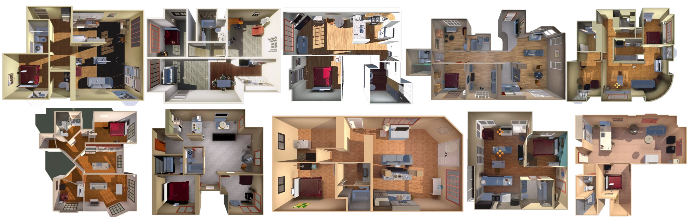
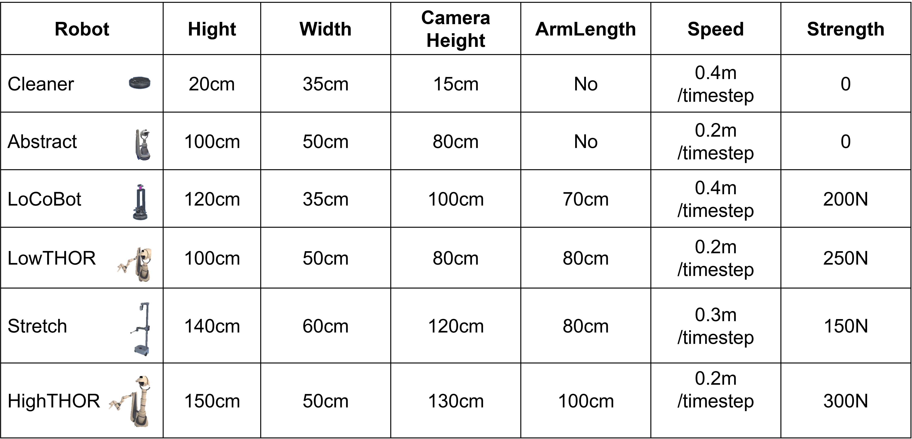

# Proactive Collaboration via Autonomous Interaction

Human teams are good at dynamically restructuring both task assignments and team composition in response to emerging challenges, proactively recruiting or releasing team members as needed. This capability for context-aware adaptation is central to collective intelligence but remains unresolved for multi-robot systems, which typically adopt the fixed paradigm, where team membership is predetermined, or the reactive paradigm, where robots only adjust after unexpected changes occur. In this work, we present a systematic investigation of a proactive collaboration paradigm for embodied intelligence, in which autonomous agents actively monitor team progress and environmental context, initiating membership changes to optimize performance as tasks evolve. We implement this paradigm by equipping LLM-powered embodied agents with autonomous interaction mechanisms that support collective reflection, purposeful discussion, dynamic team composition changes, and seamless coordination. Through simulation and real-world experiments, we show that proactive collaboration enables timely role reassignment and task-specific recruitment, yielding substantial gains in team efficiency and robustness compared to conventional approaches. Our results further suggest that enabling agent-level initiative, rather than relying on increasingly complex communication protocols, promotes scalable, adaptive, and cohesive team behavior. These findings advance the development of resilient robot collectives and lay the groundwork for emergent group-level intelligence in artificial systems.

> We get pleasure from helping other people, but we find it difficult to ask for help for ourselves.

---


## Overview

Human teams often follow a more advanced and flexible collaboration paradigm: **proactive collaboration**. Rather than reacting passively, they assess their collective capabilities, anticipate challenges, and adapt their composition proactively in response. 

For example, in high-stakes settings such as emergency medicine, attending physicians do not remain passive when a case exceeds their expertise. Instead, they proactively assemble a temporary team of specialists to resolve the issue. Once the situation is stabilized, the specialists step back, and the team returns to its original configuration

Given its effectiveness in human teams, we investigate **how this paradigm can be introduced into robot teams.**

We implement **Proactive Collaboration**  by equipping LLM-powered embodied agents with **Autonomous Interaction** mechanisms.

----

 

## Proactive collaboration

- **Defination**

  In heterogeneous robot teams, **proactive collaboration** entails dynamically adjusting team composition during task execution in response to environmental changes and task progression, either by **recruiting** additional members or **releasing** those no longer
  needed. 

- **Challenges**

  - The team must determine **when** and **how** to proactively adjust its composition.
  - As the team evolves, **continuous task planning** becomes increasingly difficult, especially when coordinating robots with varying capabilities.
  - An effective **communication mechanism** is essential to ensure smooth coordination throughout the process.

---


## Autonomous Interaction:

- **Purposeful expression**

  During the ***thinking stage,*** each robot first formulates its **communication purpose** based on accumulated state information and prior message exchanges. 

  These purposes then guide the subsequent ***speaking stage***, during which the robot determines **what information to convey and to whom**, ensuring that interactions remain focused and
  goal-directed.

- **Autonomous Need-Driven Communication**

  Inspiration from **human meetings**, in this approach, **robots intending to speak** first initiate interactions, each having a single opportunity to express themselves. Robots explicitly **mentioned in these messages** are then allowed to respond, enabling an iterative exchange. This process **continues until no new robots are mentioned**, at which point the dialogue naturally concludes. 

  We structures multi-round interactions as **sequential exchanges**, allowing robots to autonomously adapt their communication behavior. 

  This process follows a breadth-first traversal of a dynamically evolving **communication graph**. The graph is initialized with the robots intending to speak as the initial nodes, all connected to a virtual root node that facilitates the traversal. During each round, the current speakers dynamically select target robots, creating new nodes and edges in the communication graph. This progressive expansion of the graph structure reflects the evolving interactions, enabling adaptive information exchange and coordination among robots. Once all nodes have been traversed, the communication naturally concludes.

---


## DynaTeamThor

To the best of our knowledge, no benchmark dataset exists for heterogeneous proactive collaboration. Therefore, we develop DynaTeamTHOR, a multi-robot collaboration environment built on the *HumanThor* framework, and introduce a benchmark task for household tidying-up. This task is particularly well-suited for evaluating the performance of heterogeneous proactive collaboration, as it involves a variety of challenges that require collaboration, adaptability, and efficient division of labor among robots with different capabilities.

DynaTeamTHOR includes **10** multi-room house settings, each containing over **50** objects, and supports **collaborative pull and push actions** by robots, as shown in Fig.[1](scene_thor). The platform integrates the THOR simulator, powered by the Unity physics engine, with Python-based software to manage robot configurations and environment settings through HTTP-based APIs. 



Each robot's physical attributes are represented as a tuple, $(\alpha_{nav}, manip, h, w, cam)$, where $\alpha_{nav}$ denotes navigation ability in terms of moving speed, $manip$ refers to manipulation capabilities, including range, height bounds, and strength (indicating the maximum force for pushing or pulling objects), $h$ and $w$ represent height and width, affecting mobility, and $cam$ specifies the camera viewpoint, influencing perception. 

As illustrated in Fig. [2](robot_in_thor), DynaTeamTHOR defines six distinct robot configurations, offering flexibility to set performance parameters such as $speed$ and $strength$, enabling diverse robot capabilities for various tasks.




---


## Environment Setup

### Unity environment setup

The Unity engine must be installed beforehand to support our environment.

Then, build the project using the following command:

```bash
xxx
```


### Python environment setup

Once Python is installed and unity environment have been built, you will need to install the project dependencies. Clone this repository to your local machine, navigate to the cloned directory, and run the following command:

```bash
pip install -r requirements.txt
```

This command installs all the necessary Python packages listed in the requirements.txt file.


